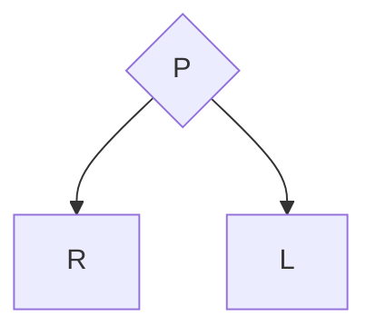
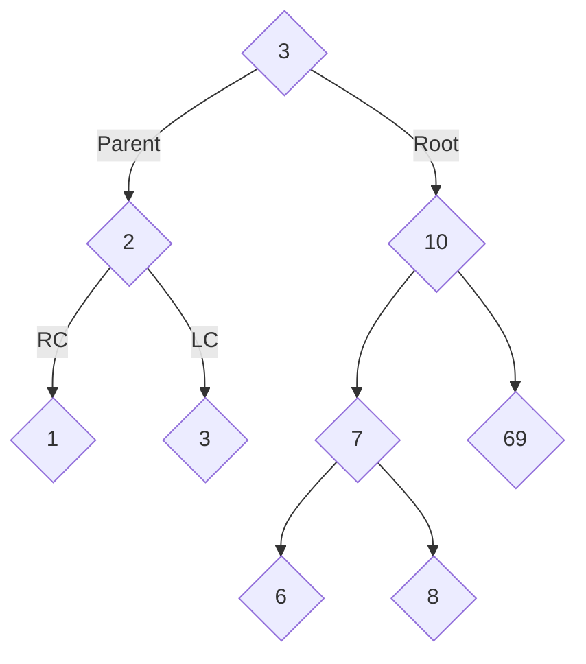

# Python
## TD
This repository is used for putting my TD in to keep it **clean and organized.**

The TD are under the folder src -> TDx.

Either it will be my solution or the teacher solution with comments explaining here and there what the code do.

I will also maybe explain some stuff here

## BST
### Left smaller, right greater

### RPL
Right Parent Left

### Example

## DFT
### Depth First Traversal

1,2,3

3,6,7

8,10,69

**1,2,3,3,6,7,8,10,69**
